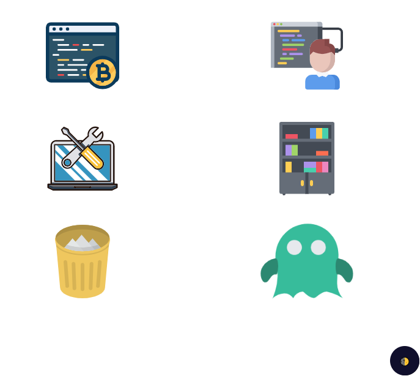

# 简易文件管理系统

支持 pc 端和移动端访问

演示地址：[https://liar0320.github.io/fileSystem/dist/index.html](https://liar0320.github.io/fileSystem/dist/index.html)

## 项目安装

```
git clone https://github.com/Liar0320/fileSystem.git
```

或者你也可以下载 rar 解压

```
npm i
npm run fronted #启动前端项目 密码 159753
npm run server #启动后台服务
```

## 目录结构

```bash
├── server                     // 服务端代码
├── src                        // 前端代码
│   ├── assets                 // 静态资源
│   │   ├── content            // css资源
│   │   ├── images             // 图片资源
│   ├── components             // 项目组成组件
│   ├── pages                  // 前端页面
│   ├── vendors                // 第三方插件配置
│   ├── index.vue              // 入口组件
│   ├── main.js                // 入口
└── ...
```

## 打包部署

自行部署

## 项目介绍

### 功能介绍

- [x] 上传下载文件
- [x] 分类展示
- [x] 提供动态笔记

### 项目展示


